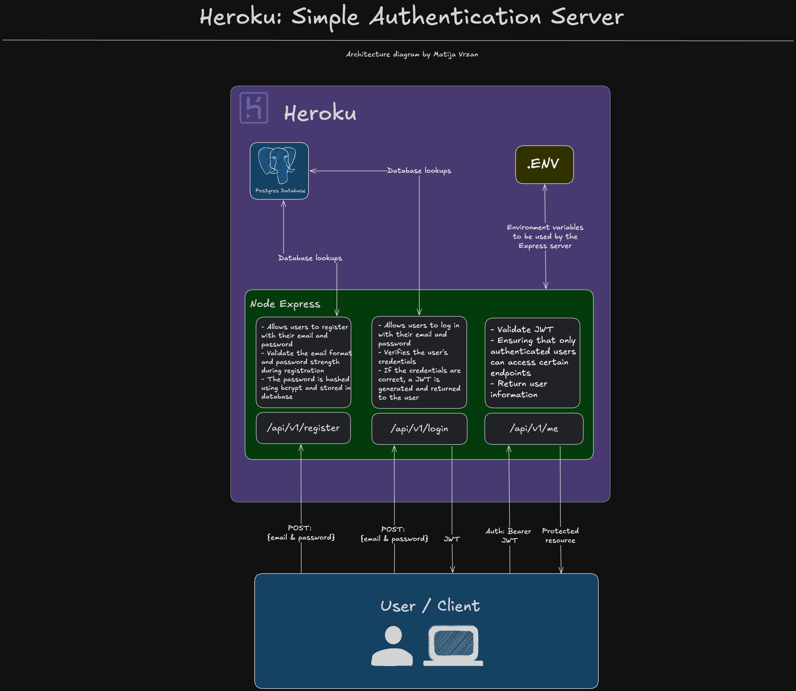

<p align="center">
<a  href="https://www.heroku.com/"></a>

<p/>

# Heroku: Simple Authentication Server

This project is a simple authentication server built with Node.js and Express. It provides basic authentication functionalities such as user registration, login, and JWT (JSON Web Token) validation. The server is designed to be deployed on Heroku, but it can also be deployed on other platforms.

- [Heroku: Simple Authentication Server](#heroku-simple-authentication-server)
  - [What does it do?](#what-does-it-do)
  - [How does it work?](#how-does-it-work)
    - [Architecture diagram](#architecture-diagram)
  - [Technologies used](#technologies-used)
- [Configuration](#configuration)
  - [Requirements](#requirements)
  - [Setup](#setup)
    - [Local environment configuration](#local-environment-configuration)
    - [Development](#development)
  - [Deployment](#deployment)
      - [Can I deploy this anywhere else other than Heroku?](#can-i-deploy-this-anywhere-else-other-than-heroku)
- [License](#license)
- [Disclaimer](#disclaimer)

---

## What does it do?

This project provides a simple authentication server with the following features:

- **User Registration**:

  - Allows users to register with their email and password.
  - The password is hashed using bcrypt before being stored in the database to ensure security.
  - Validates the email format and password strength during registration.

- **User Login**:

  - Allows users to log in with their email and password.
  - Verifies the user's credentials by comparing the provided password with the hashed password stored in the database.
  - If the credentials are correct, a JWT (JSON Web Token) is generated and returned to the user.
  - The JWT can be used for subsequent authenticated requests.

- **JWT Validation**:

  - Provides middleware to validate JWTs, ensuring that only authenticated users can access certain endpoints.
  - Checks the validity of the JWT by verifying its signature, issuer, audience, and expiration time.
  - Ensures that the JWT is not tampered with and is still valid.

- **Protected Endpoints**:

  - Implements protected endpoints that require a valid JWT for access.
  - Middleware is used to check the presence and validity of the JWT in the authorization header.
  - Returns appropriate error messages for invalid or missing JWTs.

- **Error Handling**:

  - Provides consistent error handling and logging throughout the authentication process.
  - Returns meaningful error messages to the client for various failure scenarios, such as invalid credentials, expired tokens, and missing authorization headers.

- **Deployment Ready**:
  - Designed to be easily deployed on Heroku, but can also be deployed on other platforms.
  - Includes configuration for environment variables and database connections.

These features provide an example of a simple authentication server for managing user authentication in applications.

The web server offers the following endpoints:

| Endpoint           | Method | Description                                            |
| ------------------ | ------ | ------------------------------------------------------ |
| `/api/v1/register` | `POST` | Register a new user with email and password.           |
| `/api/v1/login`    | `POST` | Log in a user and return a JWT.                        |
| `/api/v1/me`       | `POST` | Validate the provided JWT and return user information. |

## How does it work?

### Architecture diagram



## Technologies used

- [Node.js](https://nodejs.org/en)
- [Express](https://expressjs.com/)
- [JavaScript](https://developer.mozilla.org/en-US/docs/Web/JavaScript)
- [Heroku](https://www.heroku.com/)

For a more detailed overview of the development & production dependencies, please check [`package.json`](./server/package.json).

# Configuration

## Requirements

To run this application locally, you will need the following:

- Node.js version 20 or later installed (type `node -v` in your terminal to check). Follow [instructions](https://nodejs.org/en/download) if you don't have node installed
- npm version 10.0.0 or later installed (type `npm -v` in your terminal to check). Node.js includes `npm`
- git installed. Follow the instructions to [install git](https://git-scm.com/downloads)
- [deployment only] A [Heroku account](https://signup.heroku.com/)

## Setup

### Local environment configuration

The first step is to clone the repository and install the project dependencies for both server and client folders via a terminal interface by running the `npm install` in the proper folder:

```
cd heroku-simple-auth-server
cd server
npm install
```

The second step is to create a `.env` file in server folder. Find the `.env.example` file, copy it and rename it to `.env`.

```
cd salesforce-einstein-personalization-llm/server
cp .env.example .env
```

Edit the newly created `.env` file and update the variables with your specific information.

**Server:**

```
# Database credentials
DATABASE_USER=
DATABASE_PASSWORD=
DATABASE_HOST=
DATABASE_PORT=
DATABASE_NAME=

# JSON Web Token details
JWT_ISSUER=
JWT_AUDIENCE=
JWT_SHARED_SECRET=
```

The `Database credentials` refer to the Postgres connection details. The `JSON Web Token details` can be be whatever you want for the sake of local testing.

> NOTE: If you want to deploy this application to Heroku, you will have to create all of the above variables (for both the client and the server) as Heroku environment variables. This can be done via the [command line or the Heroku Dashboard UI](https://devcenter.heroku.com/articles/config-vars).

Once all of this is done, you are ready to run the application locally!

### Development

To run the application locally, use the command line, navigate to the `server` folder, ensure the dependencies are installed properly, and run the following:

Server:

```
cd heroku-simple-auth-server/server
npm run dev
```

This will automatically run the Express development server. Your server will be available at `http://localhost:3000`.

When you make changes to your code, the server will automatically restart to fetch new changes.

## Deployment

Once you are happy with your application, you can deploy it to Heroku!

To deploy the application to Heroku, please follow the [official instructions](https://devcenter.heroku.com/articles/git).

#### Can I deploy this anywhere else other than Heroku?

Absolutely! The only reason why Heroku is used here is because it is owned by Salesforce and at the moment of creating this I am a Salesforce employee.

> NOTE: Don't forget to re-create the environment variables in Heroku as the `.env` file will be ignored. Also, this is a proof of concept and not something that should be deployed in production.

# License

[MIT](http://www.opensource.org/licenses/mit-license.html)

# Disclaimer

This software is to be considered "sample code", a Type B Deliverable, and is delivered "as-is" to the user. Salesforce bears no responsibility to support the use or implementation of this software.
